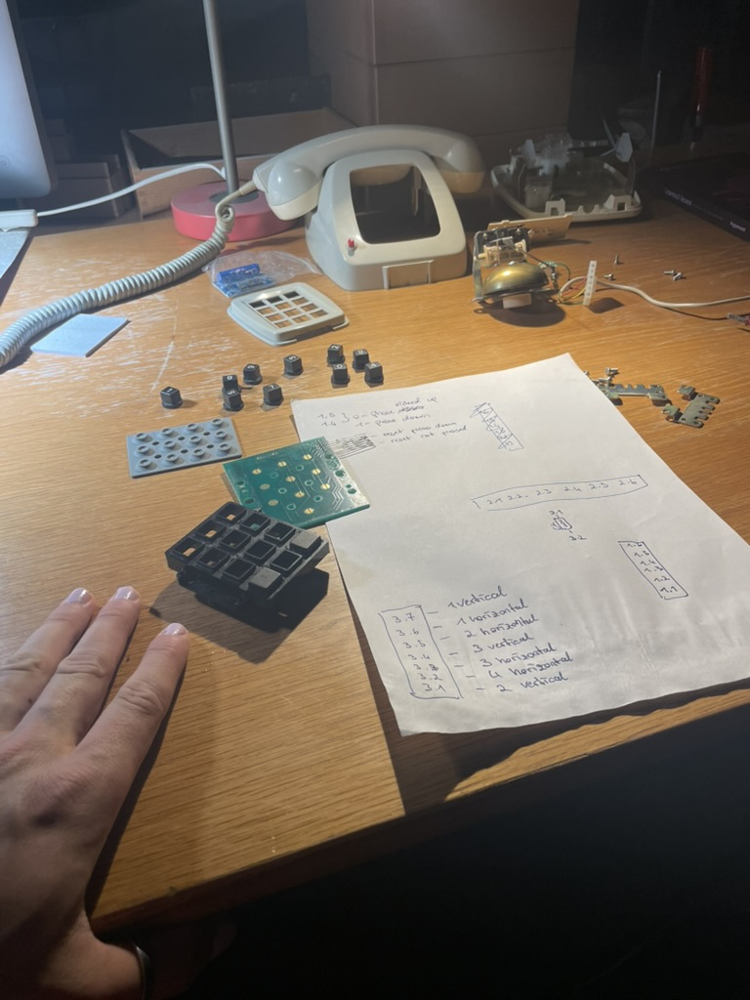
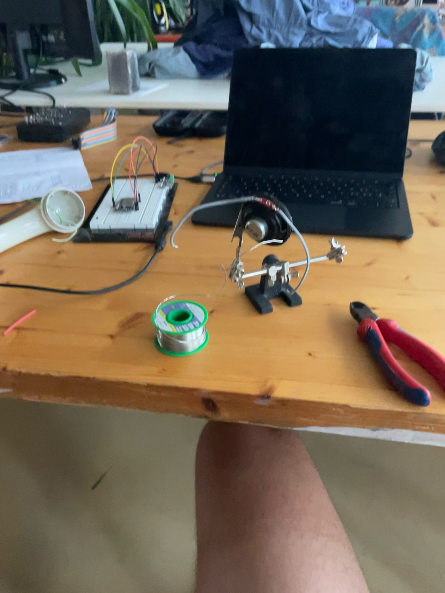

# Phone Message

An ESP32-based phone-message player. A 4x3 keypad acts as the trigger surface: pressing any key starts playback of a WAV file from a microSD card, and releasing the final active key stops playback. Audio is sent over I2S to an external DAC or amplifier.

## Demo

<video src="public/IMG_5139_compressed.mp4" controls width="420"></video>

## Build Photos





## Hardware

- ESP32 development board
- 4x3 matrix keypad
- microSD card module
- I2S audio DAC or amplifier
- Speaker
- microSD card formatted for the ESP32 SD library

## Firmware

This project uses PlatformIO with the Arduino framework.

```ini
[env:esp32dev]
platform = espressif32
board = esp32dev
framework = arduino
```

Libraries:

- `esphome/ESP32-audioI2S`
- `chris--a/Keypad`

## Pinout

### microSD Card

| Signal | ESP32 GPIO |
| --- | --- |
| CS | 5 |
| MOSI | 23 |
| MISO | 19 |
| SCK | 18 |

### I2S Audio

| Signal | ESP32 GPIO |
| --- | --- |
| DIN / DOUT | 22 |
| BCLK | 26 |
| LRC / WS | 25 |

### Keypad

| Keypad line | ESP32 GPIO |
| --- | --- |
| Row 1 | 32 |
| Row 2 | 33 |
| Row 3 | 13 |
| Row 4 | 14 |
| Column 1 | 27 |
| Column 2 | 16 |
| Column 3 | 17 |

## Audio File

The firmware currently plays:

```cpp
#define AUDIO_FILE "/Lorin_Urbantat.wav"
```

Copy `Lorin_Urbantat.wav` to the root of the microSD card, or update `AUDIO_FILE` in `src/main.cpp` to match the file you want to play.

The `Voice Notes/` folder contains source voice-note assets and converted WAV files that can be copied to the microSD card.

## Usage

1. Wire the ESP32, keypad, microSD module, and I2S audio output using the pin tables above.
2. Place the target WAV file at the root of the microSD card.
3. Install PlatformIO.
4. Build and upload:

```sh
pio run --target upload
```

5. Open the serial monitor:

```sh
pio device monitor
```

When a keypad key is pressed, the ESP32 starts the configured audio file. Playback continues while at least one key is held. When all keys are released, playback stops.

## Volume Control

Double press the reset input on GPIO 21, then press a keypad number to set the volume. Key `0` sets volume level 1, key `1` sets volume level 2, and so on up to key `9`, which sets volume level 10.

## SD Card Upload Mode

On startup the ESP32 leaves Wi-Fi in station mode and runs the normal phone-message player. To edit the SD card over Wi-Fi, press and hold the reset input on GPIO 21 for 5 seconds.

The firmware stops playback and starts an open access point:

```text
PhoneMessage Upload
```

Connect to that network from a phone or computer. The captive portal should open automatically; if it does not, browse to:

```text
http://192.168.4.1/
```

The portal lists the SD card contents, lets you download or delete existing files, and uploads new files to the SD card root.

## OTA Firmware Updates

The upload-mode access point also runs ArduinoOTA, so PlatformIO can upload firmware directly over Wi-Fi.

1. Hold the reset input on GPIO 21 for 5 seconds.
2. Connect your computer to the `PhoneMessage Upload` Wi-Fi network.
3. In PlatformIO, select the `esp32dev_ota` environment and run Upload.

From the terminal:

```sh
pio run -e esp32dev_ota --target upload
```

The USB upload environment remains `esp32dev`.

## Project Layout

```text
.
|-- src/main.cpp          # ESP32 firmware
|-- platformio.ini        # PlatformIO configuration
|-- ESP32_PINOUT.md       # ESP32 dev board pin reference
|-- Voice Notes/          # Voice-note source and WAV assets
`-- public/               # README images and demo video
```
